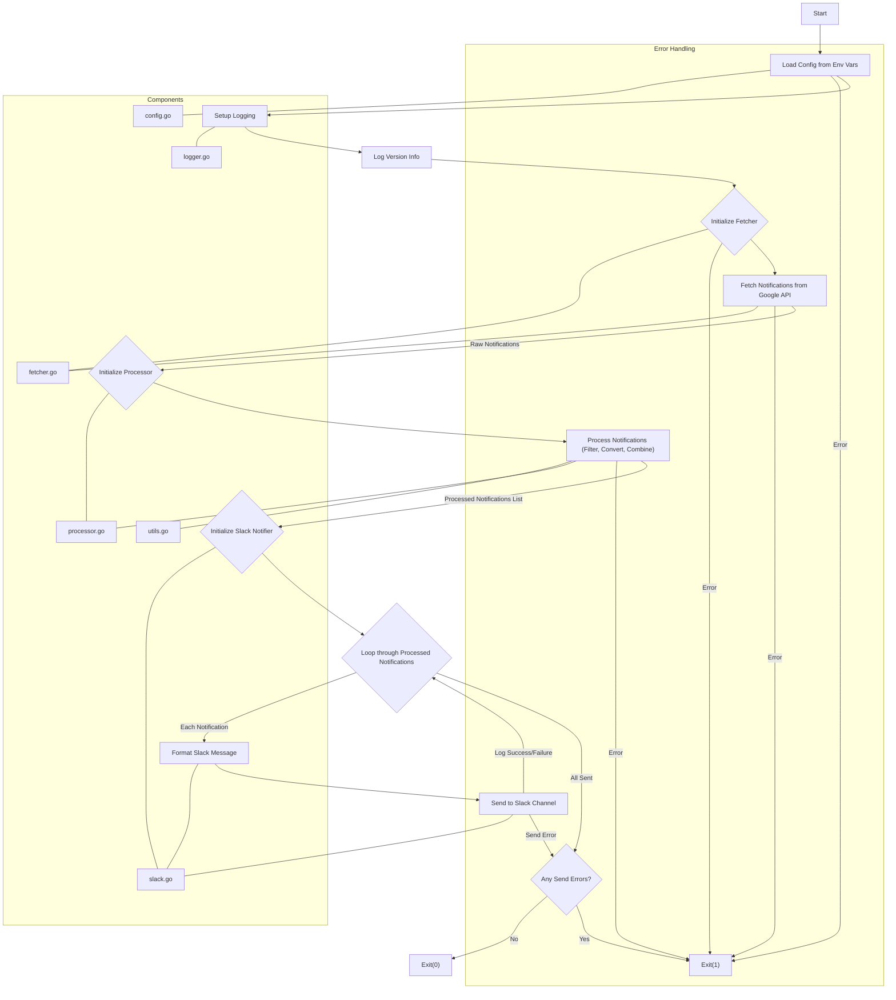

# asset-watcher

Test

A command-line utility to fetch and forward Google Cloud advisory notifications to Slack.

[](https://github.com/andreygrechin/asset-watcher/blob/main/LICENSE)

## Features

- Collect organization level advisory notifications in Google Cloud
- Send notifications to Slack

## Installation

### go install

```shell
go install github.com/andreygrechin/asset-watcher@latest
```

## Usage

```shell
export ADV_NOTIF_SLACK_CHANNEL_ID=0123456789A
export ADV_NOTIF_SLACK_TOKEN=xoxb-<YOUR_SLACK_TOKEN>
export ADV_NOTIF_ORG_ID=123456789012
export ADV_NOTIF_MAX_NOTIFICATION_AGE_SECONDS=86000
export ADV_NOTIF_DEBUG=true

make all && ./bin/asset-watcher
```

## Flow Diagram



## License

This project is licensed under MIT licenses —  [MIT License](LICENSE).

`SPDX-License-Identifier: MIT`
